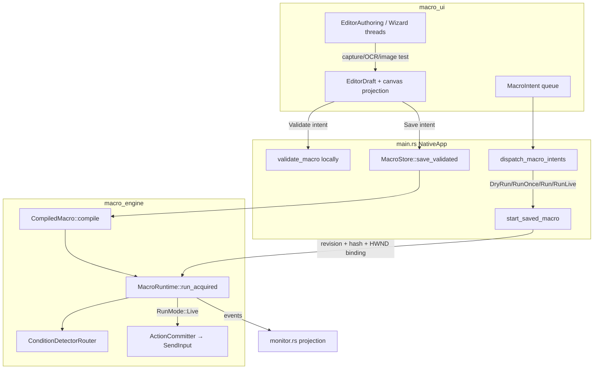

### Overview

The Macro subsystem is a **validated, observation-gated automation runtime** for a single bound Diablo window—not a general-purpose mouse-macro recorder. The **engine** (`src/engine/macro_engine/`) is substantially complete for v1: a canonical `MacroDefinition` AST (`MACRO_SCHEMA_VERSION = 1`), compile-time validation, Windows OCR + template matching, structured control flow (if/else, loops, waits, watch groups), three run modes, live click authorization, and immutable revision persistence with image verification artifacts.

The **frontend** (`src/macro_ui/`) is a separate, denser product surface: library + 430px event canvas + inspector + status strip + optional wizard, plus a 276px default bottom dock of eight run buttons and a 12-field monitor. It shares the BoBo window chrome with Enchant but not Enchant's mental model (linear checklist → Start/Stop).

**Product positioning (07-12 spec, still authoritative for the engine):** bind one game window, define text/image detectors on captured regions, gate clicks on fresh observation tokens, wrap in IF/loops/watch, validate → save → dry-run or live-run. Explicitly **not** Goto/labels, keyboard macros, record/replay, variables, or pixel-color search.

**Why Macro feels out of place next to Enchant:** same tab strip and theme, but Enchant is a ~112px-action-bar vertical wizard for occultist rerolling; Macro is an IDE-shaped graph editor with revision hashes, four start modes, and debug monitor copy—crammed into a 900×1080 window that was enlarged for the canvas. An approved **07-21 canvas-first redesign** (maximized workspace, drawers, compact run dock) was never implemented; shipped UX follows **07-13** (five-region page, fixed canvas height).

---

### Key Concepts

| Concept | Meaning |
|---|---|
| **`MacroDefinition`** | Canonical executable tree: `TargetProfile`, named `regions`/`points`, `text_rules`/`image_rules`, root `blocks`, `SafetyPolicy`. Defined in `model.rs`. |
| **`Block` / `BlockKind`** | Executable nodes: `Observe`, `Action`, `If`, `Wait`, `RepeatN`, `RepeatUntil`, `Continuous`, `WatchGroup`, `StopSuccess`/`StopError`, `Comment`. |
| **`Condition` + `ObserveMode`** | How Observe/If/RepeatUntil poll: `CheckNow`, `WaitForTrue`, `WaitForFalse`—each with `timeout_ms` and `TimeoutOutcome` (`Continue`, `StopError`, `RunBody`). |
| **Observation token** | Per-run evidence keyed by `source_block_id`. Actions that click a match require a current token; tokens invalidate on pause, side-effect epoch bump (after live click), or unmatched poll. |
| **`EditorDraft` vs saved revision** | UI edits a draft; **runs always use a saved revision** (`SavedMacroIdentity` + hash match) plus a session-bound `CapturedTargetBinding` recaptured for the saved `TargetProfile`. |
| **`MacroCanvasLayout`** | Non-executable pan/zoom/node positions persisted in `UiStateStore.macro_layouts`. Canvas is a **projection** of `definition.blocks`, not a second graph. |
| **`RunMode`** | `DryRun` and `ObservationOnly` both set `live = None` (plan clicks, no SendInput). `Live` commits through `ActionCommitter` only. |
| **`MacroController`** | Owns worker thread, journals (`MacroStore::open_journal`), pause/resume/stop, Once vs Continuous extent. Production path—not the test-only `RuntimeCommand` channel. |
| **Watch Group** | Concurrent passive observation lanes (global pool: 1 OCR + 2 image workers); **one** winning lane body runs; mouse stays serialized. 25ms arbitration window. |
| **Image verification artifact** | Required fingerprinted negative corpus for image rules; packages cannot import image rules without local re-verification. |

**Block kinds vs popular mouse macros**

| Capability | Engine | Canvas palette / inspector |
|---|---|---|
| If/else | `If { then_body, else_body }` | `+ IF` copies selected Observe condition; else is a port, not a block |
| Loops | `RepeatN`, `RepeatUntil`, `Continuous` | Palette: `RepeatN` only; `RepeatUntil` via conversion; `Continuous` wizard-only |
| Waits | `Wait { duration_ms }`; condition wait modes | `+ Wait`; Observe mode conversions for poll-until |
| OCR | Windows OCR, 4 preprocess profiles, Exact/Contains/Fuzzy/Absent | Inspector + wizard test; `language` not exposed |
| Image match | Multi-scale NCC, mask, stability, ambiguity margin | Inspector + recapture; mask UI thin |
| Concurrent watch | `WatchGroup` | `+ Watch` inserts one lane; no Add Lane in editor |
| Mouse click | `ClickTextMatch/ImageMatch/Point/Region` | Palette inserts left-click on match only |
| Keyboard, record, variables, drag, wheel, pixel | **Absent** from model | N/A |

---

### How It Works

#### Authoring → validate → persist → run

**1. Authoring (UI)**

- Entry: `AppPage::Macro` in `main.rs`; `MacroPage::show` composes status strip, optional `wizard::show`, workspace (library / canvas / inspector), intents queued after paint.
- Palette (`editor_toolbar` in `mod.rs`): inserts canonical blocks into `ContainerPath` targets (IfThen, LoopBody, Watch lane, root sibling). Connector drops retarget the next palette insert (`pending_canvas_port`).
- Inspector (`inspector.rs`): rich for text/image detectors; If/RepeatUntil project as detector + flow fields; Action/Comment/Stop show generic `"BLOCK"` with no editors; `SafetyPolicy` never surfaced.
- Wizard (`wizard.rs`): 9 steps emit the same `BlockKind` tree as the editor; finish clears `selected_saved` (unsaved draft).

**2. Validate & save**

- Validate: `EditorCommand::MarkValidated` → `validate_macro` (`validate.rs`)—unique IDs, rule/region refs, image verification fingerprint, watch limits, busy-loop checks for `Continuous`.
- Save: `MacroStore::save_validated` (`persistence.rs`) compiles before publish; immutable revision JSON + SHA sidecar under `{root}/macro_data/`.

**3. Start run (`main.rs`)**

`macro_run_request` maps intents:

| UI button | `ControllerRunRequest` | `RunMode` |
|---|---|---|
| Dry Run (Observe only) | `once` | `DryRun` |
| Run Once | `once` | `ObservationOnly` |
| Run (Observe only) | `continuous` | `ObservationOnly` |
| Run Live | `continuous` | `Live` |

`start_saved_macro` requires: saved revision + hash match, `build_windows_macro_runtime` with binding matching saved `TargetProfile` (path/class/title/client/DPI). Drafts cannot run.

**4. Execute (`MacroRuntime::run_acquired`, `runtime.rs`)**

- Compile → `RunStarted` → walk enabled blocks.
- **Observe / If / RepeatUntil:** `evaluate_condition`—paced by `max_observations_per_second`, polls at `rule.poll_interval_ms`, timeouts from **`ObserveMode.timeout_ms`** (not `TextRule`/`ImageRule.timeout_ms`). Success stores token under `condition.source_block_id`.
- **If:** `if_once_decision` → then/else bodies.
- **Loops:** body → `LoopYielded` → 1ms cooperative yield; `Continuous` rejected for Once extent.
- **WatchGroup:** union-region capture cycle, per-lane jobs, 25ms `arbitrate_candidates`, winner `then_body`, `cooldown_ms`.
- **Action:** `plan_action` always emits `ActionPlanned`. If `live.is_some()`, `authorize_action` + `ActionCommitter::commit_observed`; else planned only. `minimum_click_interval_ms` waits after every Action even in dry modes.
- **Stop\*** → macro-wide terminate; events journaled and projected to monitor.

**5. Detectors**

- **Text** (`text.rs`, `windows_ocr.rs`): preprocess → `Windows.Media.Ocr` → match mode + `stable_frames`.
- **Image** (`image_match.rs`): grayscale NCC or masked cosine, multi-scale, clustering, runner-up margin, drift limit. Client size/DPI must match `TargetProfile` or detector bails.
- **Stale generation/epoch** → unmatched (watermark), not crash.

**6. Run mode semantics (verified)**

`DryRun` and `ObservationOnly` are **functionally identical** for action planning: both increment `non_authoritative_planned_clicks`, neither calls SendInput. Difference is event tag + UI label only. Default **Run** is continuous **ObservationOnly**—it does not click. Only **Run Live** injects mouse input.

---

### Where Things Live

| Layer | Path | Responsibility |
|---|---|---|
| **Shell / routing** | `src/main.rs` | `AppPage`, window 900×1080, `dispatch_macro_intents`, `start_saved_macro`, `build_windows_macro_runtime`, Enchant vs Macro bottom surfaces |
| **Macro UI** | `src/macro_ui/{mod,canvas,canvas_model,canvas_layout,inspector,library,monitor,wizard,editor}.rs` | Draft editing, canvas projection, intents, monitor, wizard |
| **UI persistence** | `src/ui_state.rs` | `macro_layouts` (pan/zoom/positions; `library_width`/`inspector_width` stored but unused in layout) |
| **Theme** | `src/ui_theme.rs` | Shared typography; block category colors (Observe/Decide/Act/Repeat) |
| **Engine model** | `src/engine/macro_engine/model.rs` | `MacroDefinition`, `BlockKind`, rules, safety |
| **Validation** | `validate.rs` | Structural + semantic checks pre-compile |
| **Runtime** | `runtime.rs` (~13k lines) | Compile, execute, events, `MacroController`, live authorization |
| **Observation** | `observation.rs`, `text.rs`, `image_match.rs` | Detector trait + implementations |
| **Watch** | `watch_group.rs` | Arbitration, lane runner; `DetectorScheduler` is test prototype only |
| **Persistence** | `persistence.rs` | `MacroStore`, revisions, assets, journals, import re-verification |
| **Platform** | `src/engine/platform/windows_impl.rs`, `windows_ocr.rs` | xcap capture, HWND guard, `WindowsInputSink`, ESC hook |
| **Enchant (separate)** | `enchant_loop` | Calibrated occultist loop; mouse-path recording is Enchant-only (`main.rs`) |
| **Design specs** | `docs/superpowers/specs/2026-07-12-macro-tab-design.md` (engine contract), `2026-07-13-frontend-readability-macro-canvas-design.md` (shipped UX), `2026-07-21-macro-canvas-first-workspace-design.md` (approved, unshipped) |

**Boundary rule:** `MacroPageState` does not own store, controller, HWND, or capture (`mod.rs` comments). Widgets emit `MacroIntent` / authoring requests; `NativeApp` owns I/O and runtime lifecycle.

---

### Gotchas

1. **`TextRule.timeout_ms` / `ImageRule.timeout_ms` are dead at runtime.** Inspector edits them; `evaluate_condition` uses only `ObserveMode.timeout_ms`. Watch uses `WatchGroup.timeout_ms`.

2. **Live `find_block_by_id` skips timeout `RunBody` nests** (`runtime.rs` L2489–2514). Timeout-body actions may execute in dry modes but `authorize_action` can fail Live with "action block is not compiled."

3. **`MoveOnly` is modeled and dry-run planned; Live rejects it** as `UnsupportedBlock`. Validation does not count it as pacing for `Continuous` busy-loop checks.

4. **Two click budgets:** simulated `non_authoritative_planned_clicks` (dry/observe) vs `ActionCommitter.committed_clicks` (live). Independent ledgers.

5. **Image rules are not portable.** Compile requires bound verification artifact; import demands `LocalReverificationRequired` (banner in UI).

6. **Geometry/DPI lock.** Detectors and run startup require live client size/DPI = saved `TargetProfile`; mismatch is technical failure, not soft warning.

7. **Canvas ≠ page.** Fixed `CANVAS_HEIGHT = 430` inside a vertical `ScrollArea`, plus wrapping toolbar, side panes, status strip, wizard overlay, 276px bottom dock—at 900×1080 this is `ThreePaneCompact`, not a maximized workspace.

8. **Persisted pane widths are ignored.** `library_width`/`inspector_width` saved in layout; `workspace` hardcodes 175/250 (`mod.rs` L1967).

9. **Fit-view inconsistency.** Toolbar Fit uses height `600.0`; F-key uses `CANVAS_HEIGHT` (430).

10. **Stale UI copy and dead intents.** Library empty state says wizard "arrives in the next phase"; `MacroIntent::ShowHistory` is handled in `main.rs` but never enqueued; monitor shows `{:?}` debug formatting for some fields.

11. **Plans are stale.** `timeline.rs` was never shipped; `.planning/phases/13-macro-v1-runtime-library/.continue-here.md` predates live UI wiring. Trust code + 07-12/07-13 specs over checkbox plans.

12. **Watch is observe-concurrent, act-serial.** Not parallel clicking; global detector pool caps concurrent lane work.

---

### Product readout

#### (a) Already wired for advanced macros (engine + partial UI)

- **Control flow:** If/else, RepeatN, RepeatUntil (pre-check), Continuous (validation + execution), Wait, Watch Group with arbitration and cooldown.
- **Observation:** Windows OCR with preprocess profiles and match modes; image template NCC with mask, multi-scale, stability, negative-corpus verification.
- **Safety:** `max_runtime_ms`, `max_clicks`, observation retries/rate, `minimum_click_interval_ms`, `focus_loss` policy—all enforced at runtime.
- **Run lifecycle:** Validate → immutable save → DryRun / Run Once / continuous observe / Run Live → Pause / Resume / Stop / ESC; event journal + monitor projection.
- **Authoring paths:** Canvas palette + conversions, inspector detector tests/recapture, 9-step wizard, import/export with image re-verification banner.
- **Platform:** HWND-bound capture, live click authorization tied to token/frame geometry, emergency stop.

#### (b) UI gaps that make Macro feel out of place next to Enchant

- **Density mismatch:** Enchant = linear steps + one Start/Stop bar; Macro = library + graph + inspector + 8 run buttons + 12-field monitor + optional wizard, inside scroll view.
- **Fake connection state:** Status strip hardcodes `WINDOW: Not connected`, `FOREGROUND: Unknown`, `GEOMETRY: Snapshot only` while Enchant shows live OCR results.
- **Vocabulary collision:** Revision hashes, Draft/Ready, Observe/Decide/Act chips vs Enchant's "Set Enchant button" / Start.
- **Chrome asymmetry:** Window enlarged to 900×1080 for Macro; Enchant still uses 112px bottom bar; Macro defaults 276px bottom dock.
- **Incomplete editors:** Action types, comments, safety, timeout outcomes, extra watch lanes, `StopError`, OCR language, image mask—exist in model, invisible or conversion-only in UI.
- **Stale copy:** Empty library promises future wizard; debug strings in toolbar/monitor.

#### (c) Recommended next frontend direction

**Shipped contract today: 07-13** (`2026-07-13-frontend-readability-macro-canvas-design.md`)—five-region page, 900×1080, LTR canvas projection, drawers only below 720px, bottom run dock. README Manual UAT tests this, not 07-21.

**Approved but unshipped: 07-21** (`2026-07-21-macro-canvas-first-workspace-design.md`)—explicitly "replace the control-heavy Macro page" with:

- Maximized canvas between compact header and **one-line** expandable run dock (not 276px default monitor grid).
- Library + inspector as resizable/pinnable **drawers** + tool rail; wizard/file ops in overflow menu (not permanent status strip).
- TB-default layout with per-macro orientation; repeat **body-return wire to first body task** (today `LoopReturn` self-loops on Repeat node).
- Add-step UX: output `+`, drag-to-empty palette, double-click, Tab—replacing toolbar-retarget after connector drop.
- Runtime-driven n8n-like animation on active nodes/edges; floating zoom controls; real drawer-width persistence.

**Pragmatic sequence for a product owner:**

1. **Near-term (07-13 completion):** wire status strip to real `TargetGuard` binding; expose `ShowHistory`; fix pane-width persistence; add Continuous + Watch lane + `StopError` to palette; Action/Comment/Safety inspectors; remove stale copy; unify Fit height.
2. **Medium-term (07-21):** canvas-first layout as the Macro tab's primary experience—without waiting on engine changes. Enchant can keep compact chrome or inherit only the shared header per 07-21 §4.1.
3. **Do not** chase TinyTask parity in UI alone; recorder/keyboard need engine types first (07-12 §18 exclusions still hold).

#### (d) Backend gaps vs classic mouse-macro expectations

| Expectation | Status |
|---|---|
| If/else, loops, waits | **Wired** |
| OCR / image template click | **Wired** (Windows OCR + NCC; not OpenCV/ONNX) |
| Record mouse path / replay | **Missing**—by design; Enchant has mouse recording, Macro does not |
| Keyboard typing / hotkeys / modifiers | **Missing**—no `BlockKind` or `Action` variant |
| Variables, expressions, counters | **Missing** |
| Drag, scroll wheel, pixel-color wait | **Missing** |
| Goto / labels | **Rejected** by design |
| Move without click (`MoveOnly`) | Model + dry-run only; **Live unsupported** |
| Rule-level detector timeout | Persisted; **not executed** (use `ObserveMode.timeout_ms`) |
| Live clicks in timeout `RunBody` | Execute path yes; **`find_block_by_id` gap** for authorization |
| Default Run = live clicking | **No**—explicit Run Live only |
| Global hotkey / scheduled / multi-macro concurrent | **No** |
| Nested Watch Groups, parallel lane clicking | **Invalid** in v1 |

**Backend that is already correct (little wiring needed):** compile/validate pipeline, three run modes, observation tokens, live `ActionCommitter`, watch arbitration, persistence/journals, image verification gate, Windows platform bundle.

**Backend that needs work for product completeness (not necessarily "classic macros"):** live authorization for timeout-body blocks; decision on `MoveOnly` Live path or removal; whether `TextRule`/`ImageRule.timeout_ms` should be wired or deleted; `ObservationOnly` vs `DryRun` semantic split (currently identical for clicks); potential `TargetGuard` → status-strip projection API for UI.

---

### Open questions (honest)

- Is **07-21** now the acceptance bar, or must UAT stay on **07-13** until a written implementation plan exists?
- Should `TextRule`/`ImageRule.timeout_ms` be removed, or should runtime honor them separately from `ObserveMode`?
- Should Live `find_block_by_id` walk all `TimeoutOutcome::RunBody` containers?
- Is `MoveOnly` a future Live feature or dead weight in v1?
- Should `ShowHistory` get a panel, or should README drop history from UAT?
- For "popular mouse macro" positioning: is keyboard/recording still explicitly out of scope (07-12 §18), or has the product goal shifted? Engine has no types for the latter today.
