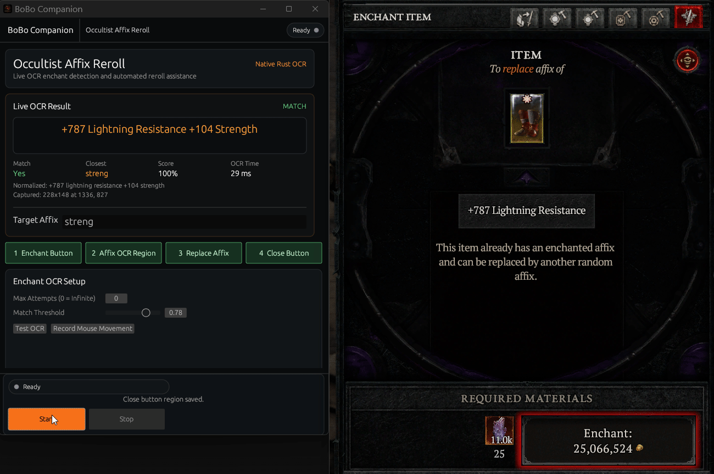

# Diablo Masterwork Companion

A Windows companion for Diablo IV enchanting. It watches the affix result, compares it with your target, and repeats rerolls until it finds a match or you stop it.
# Setups

# Operating

## What It Offers
- Saves your button and affix-area setup.
- Checks each reroll result for your target affix.
- Stops when a match is found.
- Lets you stop any time with `ESC`.
- Supports unlimited attempts by setting max attempts to `0`.
Setup Guide

## Initial Setup
Launch Diablo IV and navigate to the Occultist
Open the Enchant interface
Place your item in the Enchant slot
## Capture Your Buttons
This is the most critical step:

1. Click and drag Enchant button over the button
2. Click enchant once to bring up the enchant option
3. Click and drag Affix OCR Region over the affix on the enchant window
4. Click and drag Replace Affix over the button
5. Click and drag  Close button over the Close button
6. Type in the desire Affix in the Target Affix field above the buttons.
7. Hit Start and layback!

## Mouse Behavior:
Enable human-like movement for more natural automation

## During Operation
The bot will automatically click upgrade buttons
It monitors for your desired affix after each attempt
Press ESC at any time to stop the bot immediately
Move mouse to screen corner to trigger PyAutoGUI failsafe

## When Complete
Bot stops automatically after reaching success target
The tool requires several reference images to function. These should be placed in a resources/ folder:
## Ownership

Copyright (c) 2026 Howard Starfield. All rights reserved.

This project is not affiliated with or endorsed by Blizzard Entertainment..
